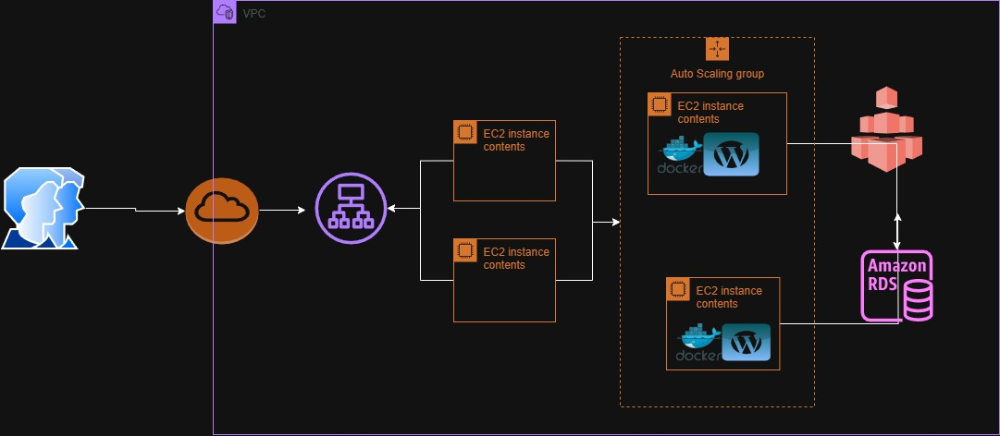

<h1 align="center" >WordPress Escalável na AWS </h1>
<p align="center">
  
</p>

---

Este projeto descreve uma infraestrutura robusta e escalável para hospedar WordPress de forma containerizada na AWS, utilizando scripts de User Data. A arquitetura implementada emprega Auto Scaling Group, Application Load Balancer, Amazon EFS e RDS, assegurando alta disponibilidade e performance para ambientes de produção, com monitoramento integrado via CloudWatch.

---

<h1 align="center" >🌐 Diagrama da Arquitetura </h1>




 <h1 align="center" > ⚙️ Camadas Principais </h1>

1. **Rede (VPC)**
   - VPC personalizada com 2 subnets públicas (ALB) e 4 privadas (EC2/RDS)
   - Internet Gateway (IGW) e NAT Gateway
   - Route Tables configuradas para roteamento correto

2. **Camada de Aplicação (Compute Layer)**
   - EC2 instances gerenciadas por um Auto Scaling Group, com um Launch Template definindo a configuração inicial.
   - O script de User Data é responsável por instalar o WordPress, montar o Amazon EFS e estabelecer a conexão com o RDS.
   - A camada de aplicação está associada a um Application Load Balancer (ALB) 

3. **Camada de Armazenamento**
   - Amazon EFS montado em todas as instâncias EC2
   - Armazena uploads, plugins e temas do WordPress

4. **Banco de Dados**
   - Utiliza Amazon RDS (MySQL) para o gerenciamento do banco de dados.
   - O acesso ao banco de dados é restrito, permitindo conexões apenas das instâncias EC2 da aplicação.
   - A configuração do RDS inclui backup automático e opções de failover para alta disponibilidade

---

<h1 align="center" > 📑 tabela de serviços  </h1>

<div align="center">

<table>
  <thead>
    <tr>
      <th>Categoria</th>
      <th>Serviço AWS</th>
      <th>Função</th>
    </tr>
  </thead>
  <tbody>
    <tr>
      <td>Rede</td>
      <td>VPC, Subnets, IGW, NAT Gateway</td>
      <td>Isolamento e roteamento seguro</td>
    </tr>
    <tr>
      <td>Computação</td>
      <td>EC2, Auto Scaling Group, Launch Template</td>
      <td>Escalabilidade automática da aplicação</td>
    </tr>
    <tr>
      <td>Balanceamento</td>
      <td>Application Load Balancer</td>
      <td>Distribuição de tráfego</td>
    </tr>
    <tr>
      <td>Armazenamento</td>
      <td>Amazon EFS</td>
      <td>Persistência de arquivos compartilhados</td>
    </tr>
    <tr>
      <td>Banco de Dados</td>
      <td>RDS (MySQL)</td>
      <td>Persistência confiável com alta disponibilidade</td>
    </tr>
    <tr>
      <td>Segurança</td>
      <td>Security Groups</td>
      <td>Controle de acesso às instâncias e banco</td>
    </tr>
  </tbody>
</table>

</div>

---

## 📷 Prints do Projeto

### 🔹 EFS
Sistema de arquivos elástico para armazenamento compartilhado.  


---

### 🔹 RDS
Banco de dados MySQL gerenciado para o WordPress.  


---

<h1 align="center" > 🔧 trecho do User data </h1>

```
set -e 

sudo apt update -y && sudo apt upgrade -y 

sudo apt install -y docker.io docker-compose nfs-common  mysql-client
sudo systemctl enable --now docker
sudo usermod -aG docker ubuntu
sudo chown -R ubuntu:ubuntu /home/ubuntu

cat <<EOF > /home/ubuntu/docker-compose.yml
version: '3.3'
services:
  wordpress:
    image: wordpress:latest
    ports:
      - "80:80"
    restart: always
    environment:
      WORDPRESS_DB_HOST: ${ENDERECO_DO_RDS:3306}
      WORDPRESS_DB_USER: ${USER_DO_BANCO_DE_DADOS}
      WORDPRESS_DB_PASSWORD: ${SENHA_DO_BANCO_DE_DADOS}
      WORDPRESS_DB_NAME: ${NAME_DO_BANCO_DE_DADOS}
      WORDPRESS_CONFIG_EXTRA: |
        define('WP_HOME', '${URL_DO_ALB}');
        define('WP_SITEURL', '${URL_DO_ALB}');

    volumes:
      - /var/www/html/wp-content:/var/www/html 

```
---

<h1 align="center" > 📊 Monitoramento com CloudWatch </h1>
**Objetivo:** Monitorar a CPU das instâncias EC2 do grupo `wordpress-as` e ajustar automaticamente a quantidade de instâncias.

**Passos:**

**Acessar CloudWatch:**  
- Console AWS → CloudWatch → Alarms → Create alarm  

**Selecionar Métrica:**  
- EC2 → Per-Instance Metrics → CPUUtilization → selecionar instâncias do grupo `wordpress-as`  

**Definir Condição:**  
- Tipo: Static  
- Condição: CPUUtilization > 50%  
- Período: 5 min  
- Evaluation periods: 2  

**Configurar Ação (Auto Scaling):**  
- Add Auto Scaling action → Auto Scaling group: `wordpress-as`  
- Scale Out: +1 instância quando CPU > 50%  
- Scale In: -1 instância quando CPU < 20%

### 🔹 Métricas CloudWatch
Monitoramento de CPU e ajuste automático do Auto Scaling.  


---

### 🔹 Painel CloudWatch
Visão geral do monitoramento e alarmes configurados.  


